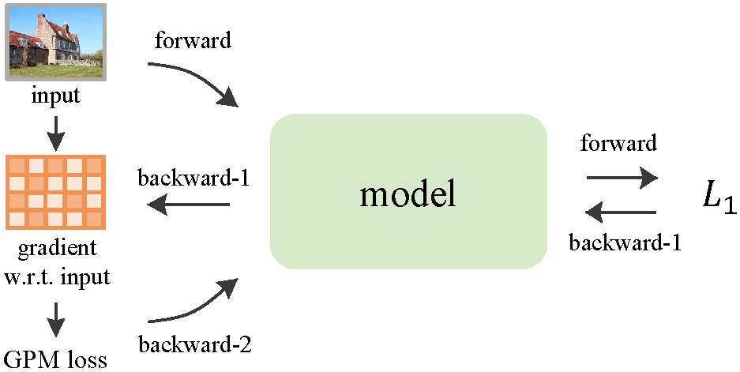

# Towards Robust and Generalizable Vision Systems: A Gradient Penalty Method

The official implementation of our paper.

## Abstract👓

Most deep neural networks are trained by gradient descent with first-order gradients. However, these networks can be highly sensitive to minor perturbations in input data, which may adversely affect the generalization capability due to the incorrect prior knowledge of models. In this work, we explore a gradient penalty method (GPM) to penalize the sensitivity of models to small input variations, by leveraging both first- and second-order gradients. We extensively evaluate GPM on classification, detection, segmentation, and video action recognition tasks across eight datasets. We show that this method consistently improves model performances across a wide range of tasks, achieving a maximum improvement of 2.8\% and setting new state-of-the-art (SOTA) results on Cadis and CholecT45 datasets. GPM also outperforms SAGM, a SOTA generalization method designed to flatten the loss landscape. Furthermore, the models trained with our approach all exhibit enhanced adversarial robustness, with improvements of up to 38.91\%. This method is straightforward, easy to implement, and integrates seamlessly with other techniques. The source code is publicly available at \url{https://github.com/VCL-HNU/GPM}.


## Highlight✨

- We present GPM to explicitly penalize the sensitivity of models by employing the second derivative, with the insight that models should not be highly sensitive to minor perturbations in input data.
- We extensively evaluate the effectiveness of GPM on various tasks, including classification, detection, segmentation, and video action recognition, across 8 datasets.
- We also verify that  this method is compatible with a variety of state-of-the-art (SOTA) models and methods. 
- On Cadis and CholecT45 datasets, directly incorporating GPM yields new SOTA performances. GPM also outperforms the SOTA method SAGM for generalization.
- We further conduct a series of experiments to investigate the properties of GPM and to understand the underlying mechanism. We show that expect for accuracy, GPM also improves the adversarial robustness of models.


## Method Overview💡

To reduce the sensitivity of models to small perturbations in input data, we calculate the gradients of the first-order loss w.r.t. input data through backpropagation (backward-1), penalize the gradients, then perform a second backpropagation pass (backward-2) and adjust model parameters accordingly.




## Installation

This code is based on [OpenMMLab](https://github.com/open-mmlab). Please first download the repository and set up the environment.

For environment setup:

```
conda create -n mm python==3.8
conda activate mm
pip install torch==1.13.1+cu117 torchvision==0.14.1+cu117 --extra-index-url https://download.pytorch.org/whl/cu117

pip install -U openmim
mim install "mmcv==2.1.0"

pip install future tensorboard
pip install pytorchvideo
pip install ftfy
python -m pip install cityscapesscripts
pip install eagerpy
pip install scipy
pip install gitpython
pip install regex
pip install scikit-learn
pip install PrettyTable
pip install einops
pip install mat4py
pip install shapely
pip install terminaltables
pip install nuscenes-devkit
pip install numba
pip install scikit-image
pip install lyft-dataset-sdk
pip install trimesh
pip install plyfile
pip install regex
pip install albumentations
pip install quadprog
```

Please install `mmcv==2.1.0`, and copy the file `_ext.cpython-38-x86_64-linux-gnu.so` from the installed package into the mmcv directory under the project root.

The code has been tested on a Linux operating system and is designed to run on GPU devices.

For other details and help, please refer to the [official tutorials](https://mmpretrain.readthedocs.io/en/latest/user_guides/config.html).

---

## Data Preparation

Please prepare the dataset you intend to use according to the instructions in the [official tutorial](https://mmpretrain.readthedocs.io/en/latest/user_guides/dataset_prepare.html).

---

## Training and Testing

To start training and testing, please use the provided shell script in the `mm_tools` directory:

```bash
bash mm_tools/train.sh
```

In the `train.sh` file, you can modify the following:

- **CUDA_VISIBLE_DEVICES**: Set the CUDA device index you want to use.
- **CONFIG**: Specify the path to the config `.py` file.

Config files are stored in the `configs/GPM/` directory.

---

## Acknowledgements

This project is implemented based on the [OpenMMLab](https://github.com/open-mmlab).  
We sincerely thank the authors and contributors of OpenMMLab.

---

## Citation

If this code is useful for your research, please consider citing:

```
pass
```

---


